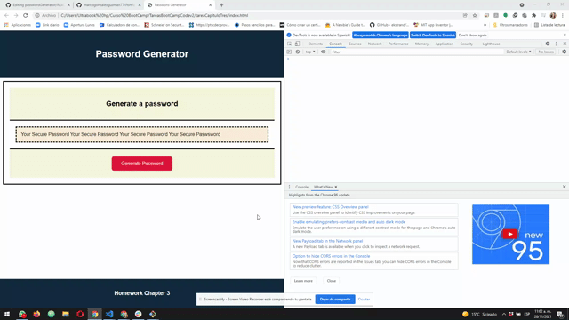

# Password Generator

## Description

With this application you can generate randow passwords based on criteria that you select. You can choose a length of at least 8 characters and no more than 128 characters. You can include in the password: lowercase, uppercase, numeric, and/or special characters.

## Web Page Functionality

The following animation shows the portafolio web application's appearance and functionality:

You can watch the web page on the next link [Password Generator](https://marcogonzalezguzman77.github.io/passwordGenerator/) for test.